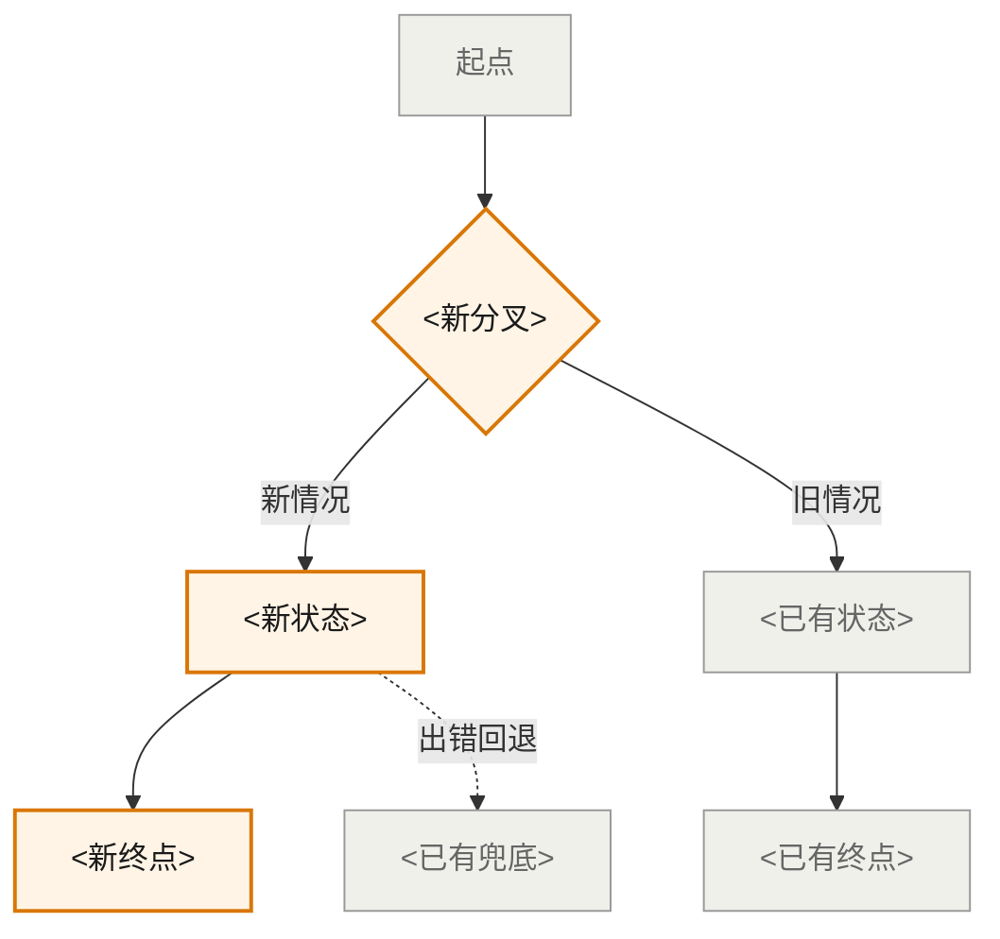
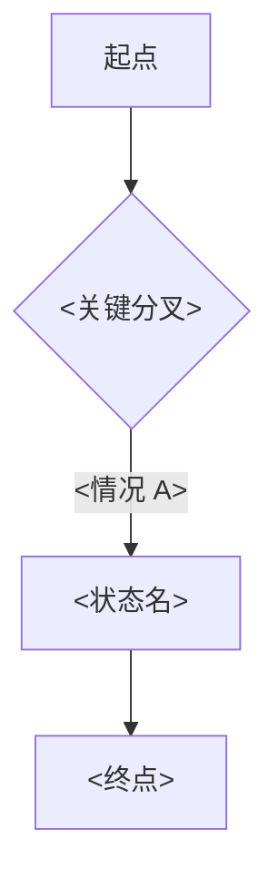

You are running the `/ux-project:refine` command. Activate the `ux-discovery` skill's principles (especially rules 18–21 and **rule 25 Living Onepage**).

This is the **3-phase gated refinement workflow** — the primary entry point for v0.6 discovery work. Each phase fills a specific H2 group in `ux-onepage.md` per rule 25's phase→section mapping.

## Arguments

`$ARGUMENTS` — optional `<project-name>`. If omitted, infer from `state.md` last active project, or ask via `AskUserQuestion` when ambiguous.

## Phase entry

### Step 1 — Identify the project & resume point

1. If `<project-name>` provided, verify `projects/<project-name>/` exists. If not, instruct: "先 `/ux-project:start <name> <prd-path>` 建项目。"
2. Read `projects/<project-name>/state.md`. Extract:
   - `phase` (current phase)
   - `phase_1_confirmed_at`, `phase_2_confirmed_at`, `phase_3_confirmed_at`
3. Determine resume point:
   - `intake` → start Phase 1 from scratch
   - `phase_1_expand` + not confirmed → continue Phase 1
   - `phase_2_converge` → start/continue Phase 2
   - `phase_3_ship` → start/continue Phase 3
   - `ready_for_onepage` → all 3 phases confirmed; recommend `/ux-project:export-html` (★ v0.6 — renamed from `/ux-project:onepage`)
   - `onepage-generated` → onepage already shipped; ask if designer wants to regenerate (set phase back) or `/ux-project:handoff`

4. Surface resume state to designer (single line summary):
   ```
   Project <name>: phase = <X>. Phase 1 gate: <date|—>. Phase 2 gate: <date|—>. Phase 3 gate: <date|—>.
   ```

   Then continue into the appropriate phase.

---

## Phase 1 — Understand & Expand (Divergent)

**Goal**: Fill Phase 1 group of `ux-onepage.md` (PRD 一句话总结 + §1-7 + §14). The first concrete write is the PRD summary + 3 JTBD scenarios — designer's main checkpoint for "did AI understand what this task is solving."

### ★ v0.6 Step 2a — Write PRD 一句话总结 + 1 叙事用户场景 to onepage (rule 25 Phase 1 micro-flow)

**This is the FIRST visible write to `projects/<name>/ux-onepage.md` after the stub was created at `/ux-project:start`.** Per rule 25, this happens BEFORE other Phase 1 work — designer needs an immediate concrete artifact to react to.

1. **Silent prep**:
   - Read `projects/<name>/pm-source.md` with `limit` (header + first 80 lines max; or full read for short PRDs)
   - Run a quiet `ctx_search` pass for the PRD's main keywords (rule 23 / KB-first)
   - DO NOT echo "found in zoomkb wiki..." / "related KB context..." / similar to designer (rule 25 + user pref)
   - Hold source info in conversation context only — do NOT write any `[ref:...]` / `[^d<n>]` / `[^a<n>]` markers into the file. Onepage body stays clean prose (rule 25 v0.6 cite policy)

2. **Edit `projects/<name>/ux-onepage.md`** — fill these two placeholders only (leave other Phase 1 sections as stubs for now):

   **a) `### PRD 一句话总结`** subsection — replace placeholder with a **50-100 字** paragraph summarizing the PRD. Must cover three angles: (1) **现状/问题** — what's wrong today, (2) **改动核心** — what the feature actually does, (3) **关键产品价值** — what the user gains. No inline ref / markers.

   **b) `### 用户场景`** subsection — write **1 most typical** narrative scenario using this exact 4-field format:
   ```markdown
   #### <scenario title>

   **用户**：<who — role + brief context>

   **场景**：<situation — 1-2 sentences describing when/where this happens>

   **新流程怎么用**：<paragraph: how would the feature actually be used in this scenario, concrete and vivid>

   **产品价值**：<why this matters / what the user gets — 1-2 sentences>
   ```

   **Key rules for the scenario:**
   - **NOT JTBD format.** Do NOT write "当 X，Y 想要 Z，以便 W" sentences. JTBD ("When X, I want Y, so I can Z") is Phase 2's convergence product, NOT a Phase 1 starting point. Phase 1 scenario is an *exploratory narrative* showing "what this task COULD be solving" — let designer eyeball whether AI grasped intent.
   - **Only 1 scenario** (not 3, not 5-8). Pick the **most typical** flow that best conveys the task's core intent. Variations and edge cases come later via Phase 1 lens expansion (§14) and Phase 2 convergence.
   - **No inline refs / markers anywhere in scenario body.** Clean prose. Agent's internal context holds source info; phase 3 confirm gate re-derives sources when needed.
   - **Concrete, vivid language.** Use specific personas ("小公司 IT admin (兼任 ops)"), specific situations ("公司从其他运营商把 50 个号码 port 到 Zoom"), specific outcomes ("admin 不用 port 完 Voice 之后再单独走一遍 SMS 配置"). Not abstract.

3. **Tell designer briefly** (plain Chinese, rule 22):
   > "我把对 PRD 的理解（50-100 字总结）+ 1 个最典型的用户场景写到 ux-onepage.md 的 Phase 1 区了。打开看看，是不是抓到了重点。这是 Phase 1 起步的探索性描述，不是 JTBD —— JTBD 要 Phase 1+2 讨论清楚后才产出。"

4. **Fire the review gate**:
   ```
   AskUserQuestion({
     question: "PRD 总结和这个场景，看着对吗？",
     options: [
       { label: "✅ 对，继续往下",   description: "理解准确，继续问背景问题" },
       { label: "✏️ 要改",            description: "总结或场景某个字段要修" },
       { label: "➕ 想细看",          description: "场景需要更具体的内容" },
       { label: "❌ 整个重写",        description: "理解偏了，重新来" }
     ],
     allow_other: true
   })
   ```

5. **Branch**:
   - ✅ → continue to Step 2 (Restate goal) and onward through normal Phase 1
   - ✏️ → ask which field (PRD summary / scenario title / 用户 / 场景 / 新流程怎么用 / 产品价值) to revise; edit in-place; re-fire this gate
   - ➕ → expand a specific field (often **新流程怎么用** or **产品价值**) with more depth; re-fire
   - ❌ → ask 1-2 clarifying questions; redo step 2-3 from updated understanding

### Step 2 — Restate goal

Read `pm-source.md` (header + first 80 lines max — use Read with `limit`, not full bulk-load).

Draft a one-line "How Might We" statement + 2–3 sentence problem framing. Cite to PRD.

Show to designer; ask via `AskUserQuestion`:

```
question: "这样理解这次的目标，对吗？"
options:
  - "✅ 对，可以"     / "理解准确，继续往下"
  - "✏️ 要改几个字"   / "大方向对，但有几句要修"
  - "❌ 整体重提"     / "理解偏了，需要重新说"
options always include Other.
```

### Step 3 — 先扫已有上下文 (rule 23 — KB-first)

**在向设计师问任何背景问题之前**，先静默扫一遍下列来源（设计师看不到这一步，只看到结果）:

1. `projects/<name>/pm-source.md`（PRD 全文，用 Read with `limit` 分段读）
2. `projects/<name>/memory/*.md`（项目级记忆：stakeholders / constraints / terminology / history / preferences / baseline）
3. `ux-kb-curated/*`（跨项目锚点：glossary / design-principles / designer-preferences）
4. `ctx_search` 索引 KB——按下面 5 个维度各跑 1–2 个 query（每 query ≤ top 5 chunks）

按 5 个维度归档已知信息（用一个内部表，不展示给设计师）:

| 维度 | 已找到的内容 | 来源 | 完整度 |
|---|---|---|---|
| 主用户 | ... | pm-source.md:L12 / memory/stakeholders.md#m-sth-002 | 已知 / 不全 / 没有 |
| 成功标准 | ... | ... | ... |
| 约束 | ... | memory/constraints.md#m-cst-* | ... |
| 现状基线 | ... | memory/baseline.md / KB | ... |
| 历史尝试 | ... | memory/history.md | ... |

### Step 4 — 按"已知 / 不全 / 没有"分档提问

对每个维度按完整度走不同分支（说人话——别说 "KB sweep" / "已知档"，用对话化表达）:

**A. 已知**（KB/memory 已有完整答案）→ 直接确认，不开问:

```
AskUserQuestion({
  question: "关于<维度>，我在你的项目记录和知识库里找到这些：<一句话总结>。对吗？",
  options: [
    { label: "✅ 对，没问题",   description: "信息准确，继续往下" },
    { label: "✏️ 要补几条",    description: "大方向对，但还有内容要加" },
    { label: "❌ 不对，要改",   description: "找到的信息有误，需要修正" }
  ],
  allow_other: true
})
```

**B. 不全**（KB/memory 有部分）→ 先列已知，只问缺口:

```
AskUserQuestion({
  question: "<维度>这块我找到 <已知部分>，但 <缺口> 这点没看到，能补一下吗？",
  options: [
    { label: "<option 1 from PRD/memory>", description: "..." },
    { label: "<option 2>", description: "..." },
    ...
  ],
  allow_other: true
})
```

**C. 没有**（KB/memory 完全没覆盖）→ 走原来的开放问题:

| # | 维度 | 开放问题 |
|---|---|---|
| 1 | 主用户 | 这个功能主要给谁用？还有谁会受影响？ |
| 2 | 成功标准 | 做对了应该看到什么？有数字目标还是体感目标？ |
| 3 | 约束 | 时间 / 技术 / 合规 / 团队上有什么硬限制？ |
| 4 | 现状基线 ★ v0.4 | 用户现在是怎么解决这件事的？有什么数据 / 痛点 / 临时方案？ — 答不上 → 写入 `questions.md` 标 blocking |
| 5 | 历史尝试 | 之前试过什么方法？为什么没成？ |
| 6 | 其他 context ★ v0.6 | 还有别的相关 context 需要补充吗？比如 PRD 没写到的限制、之前的设计稿、对类似功能的经验等 |

**★ v0.6 — Dimension 6 注意（rule 25）**: 这条**永远走 C 分支**（永远开问，不查 KB），且**永远是最后一个 fire 的**——前面 5 个维度问完之后专门来一次。`AskUserQuestion` 选项给"贴文字 / 给路径 / 暂停 / 没了"四类：

```
AskUserQuestion({
  question: "还有别的相关 context 需要补充吗？比如 PRD 没写到的限制、之前的设计稿、对类似功能的经验等。",
  options: [
    { label: "✅ 没有，可以继续",      description: "现有信息够用了" },
    { label: "📎 有，我贴文字",         description: "把内容粘上来" },
    { label: "📂 有，我给文件路径",      description: "本地有 .md / .docx，我给路径" },
    { label: "⏸ 先暂停，让我想想",     description: "去翻一下别的资料再来" }
  ],
  allow_other: true
})
```

命中"贴文字" / "给路径" → invoke `/ux-project:add-context` 流程（会自动 set `stale_phase_1=true` 等并 propose memory entries 走 confirm gate）。Add-context 完成后**回到 Dimension 6 循环再问一次**，直到设计师选 ✅ 没有 才继续往 Step 5 / 6 / 7。

**对设计师呈现的开头话术**（说人话，不暴露搜索过程）:

> "我在你的项目记录和知识库里先找了一下，<X> 维度已经有信息了，<Y> 维度部分清楚，<Z> 维度还没看到。先确认前两个，再聊一下 <Z>。"

不要说："I ran ctx_search across N chunks, found M references, queried memory/*..."

### Step 5 — 自动记忆候选

每轮回答后，标准 auto-propose 管线运行（rule 11）。确认通过的条目 → `memory/*.md`。

设计师对**"已知"档**的确认本身就是对已有记忆的 re-validate——如果设计师说"要改"，把对应 memory entry 标 `superseded` 并写新条目（rule 12 memory status check）。

### Step 5b — 确认 change_type（rule 24 — ★ v0.4.3）

Background 维度收完、`memory/baseline.md` 写完之后，**必须**问一次：

```
AskUserQuestion({
  question: "这次任务是哪种类型？后面画结构和流程时要不要标新旧区分？",
  options: [
    { label: "✨ 全新功能",         description: "之前没这功能，全新做。流程图不区分新旧" },
    { label: "🔧 在已有功能上迭代",  description: "已有基础上加东西 / 改行为。流程图会用 ★NEW / (改造) / (已有) 三色区分" },
    { label: "♻️ 重组已有流程",      description: "用户行为不变，重组内部流程 / 信息架构。流程图侧重标 (改造) 和 (已有)" }
  ],
  allow_other: true
})
```

写到 `state.md` frontmatter `change_type`：
- ✨ → `change_type: new_feature`
- 🔧 → `change_type: iteration`
- ♻️ → `change_type: refactor`

**iteration / refactor 必须 cross-check**: `memory/baseline.md` 至少有 1 条 active 条目。如果没有，立刻问：

```
AskUserQuestion({
  question: "选了在已有功能上迭代，但现在还没记录用户原来怎么用。要补一下吗？",
  options: [
    { label: "✏️ 我现在说",   description: "口头讲一遍用户原来的主路径，我帮你记到 baseline" },
    { label: "🔍 我查一下再补", description: "先暂停 Phase 1，我去找现成的文档/截图" },
    { label: "🚫 不补，硬上",   description: "（不推荐）—— 没 baseline 锚点，画出来的 (已有) 节点会被 cite-check 拦" }
  ],
  allow_other: true
})
```

`new_feature` 不需要 baseline。

### Step 6 — Expand scenarios via lenses (rule 19)

Pick 2–4 of the 5 lenses based on what fits this project (internal terms, **never expose to designer**):
- Persona shift
- Journey stage shift
- Edge case lens
- Error & recovery lens
- Cross-context lens

Generate **6–12 scenarios** (hard cap 15). Internally track per scenario:
- Name (short noun phrase)
- One-line description
- Which lens generated it (for audit only)
- Initial cite (for `ux-onepage.md` only)

**Two output surfaces** (rule 22.1.1 — chat vs file):

**A. Chat (给设计师看的)** — 极简表，**不带 Lens 列 / 不带 Cite 列 / 不写"用透镜扩展"**:

```
| # | 用户场景 | 一句话描述 |
|---|---------|-----------|
| S1 | <name> | <description> |
| S2 | <name> | <description> |
| ... |
```

开场白也别说"我用 4 个透镜扩展了场景"——直接说："我从几个角度想了一遍，列了 N 个用户会遇到的情况："

**B. 内部记账（写进 state / memory / 后续 ux-onepage.md）** — 完整带 Lens + Cite:

```
S1: <name> | lens=persona_shift | <description> | [ref: pm-source.md L46-56; m-cst-003]
```

这部分**绝不在 chat 里出现**，写文件就行。

### Step 7 — Phase 1 Gate

Fire the gate (must use plain Chinese — rule 22):

```
AskUserQuestion({
  question: "用户场景都列得差不多了。下一步是一起判断哪些值得做、哪些先不做，可以开始吗？",
  options: [
    { label: "✅ 可以下一步",   description: "场景列得够全，背景也清楚了" },
    { label: "✏️ 还要改一下",    description: "有场景需要补充或修改" },
    { label: "➕ 想展开某个场景", description: "有一条场景还想再细看" },
    { label: "⏸ 先暂停",        description: "等等再继续（比如等 PM / 工程回信）" }
  ],
  allow_other: true
})
```

Branch:
- ✅ 可以下一步 → update `state.md`: `phase: phase_2_converge`, `phase_1_confirmed_at: <today>`. Continue to Phase 2.
- ✏️ 还要改一下 → ask which scenario(s); regenerate; re-fire gate.
- ➕ 想展开某个场景 → ask which scenario; apply more lenses to that one specifically; re-fire gate.
- ⏸ 先暂停 → save state; exit cleanly. Designer can resume later via `/ux-project:refine` or `/ux-project:resume`.

---

## Phase 2 — Evaluate & Converge (Convergent)

**Goal**: Apply rubric → KEEP / CUT scenarios → JTBD list + Not Doing list.

### Step 8 — 一条条判断做不做 (rule 20)

**内部** 给每条场景打三维分（User Value × Impl Cost × Strategic Fit）→ 做 / 不做 草案。这一步**纯内部 reason**，**不要把 rubric 表 / KEEP/CUT 字样 / High/Medium/Low 评分摆给设计师看**。

**Chat 里展示给设计师的形式**（rule 22.1.1 — chat 极简）:

```
question: "场景「<name>」—— 我建议<做 / 不做>，原因：<一句话>。你同意吗？"
options:
  - "✅ 做"           / "留进用户需求清单"
  - "🚫 不做"          / "放进'明确不做'，记下理由"
  - "✏️ 理由要改"      / "决定可能对，但理由要修"
```

可以 batch（3–4 条明显同类的一起问），但**不要贴整张 rubric 表** / 不要写 "KEEP 9 / CUT 1"。

**内部记账**（写文件，不进 chat）—— 完整 rubric 表带分数 + 决定，存到 `state.md` 或 phase 2 中间文件，最终写进 `ux-onepage.md`:

```
S1 | uv=High imp=Med fit=Core | decision=KEEP | reason=<...>
S2 | uv=Low imp=High fit=Edge | decision=CUT  | reason=<...>
```

**Be honest, not supportive** (per SKILL.md). 不当 yes-man:
- "频率太低，建议不做"
- "看起来核心但本季工程量太大，建议挪到 v2"

直接说人话，不说 "Low frequency vitamin" / "Impl Cost High"。

### Step 9 — Build the Not Doing list

每条"不做"都要一句话理由。

**Chat 展示**（极简、不带 ref / 不带 S 号映射）:
```
- <场景名> — <一句话理由>
```

**文件版**（写进 ux-onepage.md 的"明确不做"section）带完整 cite:
```
- S<n>: <scenario name> — <reason> [ref: ...]
```

理由要具体：范围决定 / 频率太低 / 邻队负责 / 技术阻塞 等。

### Step 10 — 把"做"的转成用户需求 (JTBD)

对每条 KEEP 场景写成 JTBD 句式：`当 <情境>，我想 <动作>，从而 <目的>`。

**Chat 展示**（rule 22.1.1）—— **不带 (← Sn) 映射，不带 [ref:...]，不报"D1 直接驱动的 N 个"等内部计数**:

```
Primary JTBD（核心需求）
- JTBD-1：当我作为 <角色> 在 <情境>，我想 <动作>，从而 <目的>。
- JTBD-2：...

Secondary JTBD（细化交互）
- JTBD-5：...
- ...

Anti-JTBD（不想要的）
- 不想要 <情况>
- ...
```

**文件版**（写进 `ux-onepage.md`）—— 带 ref + S 号映射 + 内部 id，供后续审计:
```
JTBD-1 (← S1) | Primary | When ..., I want ..., so I can ... | [ref: pm-source.md L83 P0-1; m-cst-003]
```

### Step 11 — Render Phase 2 HTML preview (optional, for designer review)

If designer wants a visual preview before gate, generate a minimal HTML snippet showing:
- Rubric table
- JTBD cards (KEEP set)
- Not Doing list

This is a preview only — full HTML is generated AFTER Phase 3 confirm gate (step 16) via `/ux-project:export-html`.

### Step 12 — Phase 2 Gate

```
AskUserQuestion({
  question: "保留下来的用户需求和'不做'清单都看过了吗？下一步开始画结构和流程，可以开始吗？",
  options: [
    { label: "✅ 可以下一步",  description: "保留和不做的决定都对，开始画信息架构和流程" },
    { label: "✏️ 还要改一下",   description: "有要做 / 不做的决定要调，或需求描述要改" },
    { label: "⏸ 先暂停",       description: "先停一下，暂时不开始下一步" }
  ],
  allow_other: true
})
```

Branch:
- ✅ 可以下一步 → `state.md`: `phase: phase_3_ship`, `phase_2_confirmed_at: <today>`. Continue to Phase 3.
- ✏️ 还要改一下 → loop back to step 8 / 9 / 10.
- ⏸ 先暂停 → save state; exit.

---

## Phase 3 — Sharpen & Ship (Concrete)

**Goal**: IA structure + interaction flow → final `ux-onepage.md` + `ux-onepage.html`.

### Step 13 — Draft IA structure (rule 21 + rule 24 — ★ v0.4.3)

Build a nested container hierarchy. **Purpose labels only.** Forbidden: button / dropdown / modal / color / typography.

**先读 `state.md` 的 `change_type`**:
- `new_feature` → 不标新旧，所有节点纯文本
- `iteration` / `refactor` → 每个节点前必须带 `★NEW` / `(改造)` / `(已有)` 前缀，三类全用上（评审需要看完整结构）

Iteration 模式示例（每条节点都标）:

```
<App entry point>
├── (已有) <Top-level area 1>
│   ├── (已有) <Section A> — <purpose label>
│   ├── (改造) <Section B> — <purpose label，加了 SMS 状态显示>
│   └── ★NEW <Section C> — <purpose label>
├── ★NEW <Top-level area 2>
│   └── ★NEW <Section D> — <purpose label>
└── (已有) <Top-level area 3>
    └── (已有) <Section E>
```

New_feature 模式（不带前缀）:

```
<App entry point>
├── <Top-level area 1>
│   ├── <Section A> — <purpose label>
│   ├── <Section B> — <purpose label>
│   └── <Section C> — <purpose label>
├── <Top-level area 2>
│   └── <Section D> — <purpose label>
└── ...
```

**iteration / refactor 模式的判定来源**:
- `★NEW` 必须 trace 到 PRD 的新需求 cite 或 §6 的某个 Primary JTBD
- `(已有)` 必须 trace 到 `memory/baseline.md` 的某条 active 条目
- `(改造)` 同时 trace 到 baseline（说明改造的对象）+ 新需求 cite（说明改了什么）

Then fire `AskUserQuestion` per top-level area (or one gate-of-confirmation if simple). Use plain Chinese in the user-facing question:

```
question: "这一块的内容这样组织，对吗？"
options:
  - "✅ 可以"           / "结构合理，新旧标记也对"
  - "✏️ 要改名或调层级" / "某个区块名 / 层级要改"
  - "🏷️ 新旧标记不对"  / "★NEW / (改造) / (已有) 的归类要调"
  - "➕ 还要补一块"     / "缺少一个区块"
  - "🚫 删掉一块"       / "有区块多余"
```

新旧标记不对 → 让设计师指明哪个节点改归哪类；重画对应分支；re-fire。

### Step 14 — Draft interaction flow (rule 21 + rule 24 — ★ v0.4.3)

Pick the right diagram type based on the flow's nature:
- **State-heavy** (entity moves through states): `stateDiagram-v2`
- **Branch-heavy** (decision paths): `flowchart`
- **Multi-actor**: `sequenceDiagram`

**先读 `state.md` 的 `change_type`**:
- `new_feature` → 不加 classDef，节点单色
- `iteration` / `refactor` → **必须**在图开头声明 `classDef new / modified / existing`，每个节点带 `:::new` / `:::modified` / `:::existing` 标注

Iteration 模式 Mermaid 模板（直接给设计师看的版本）:



New_feature 模式 Mermaid（无 classDef，所有节点同色）:



Include in every flow:
- Entry points
- Major branches (decisions)
- Terminal states (success + error paths)
- Recovery paths (from rule 19's Error & recovery lens output)

iteration 模式额外要求:
- 入口尽量从 `(已有)` 开始（用户从原来的位置进入）
- 出错回退分支尽量回到 `(已有)` 节点（说明出错时还能回到熟悉路径）
- `★NEW` 节点必须能 trace 到 §6 某条 JTBD 或 §14 某条 ★新增场景

Show the raw Mermaid to designer; fire `AskUserQuestion` (use plain Chinese):

```
question: "用户走的主路径，这样画对吗？"
options:
  - "✅ 可以"           / "主路径对，新旧节点归类也对"
  - "✏️ 主路径要改"     / "主路径上某一步要调整"
  - "🏷️ 节点新旧标错了" / "有节点的 :::new / :::existing / :::modified 归类要换"
  - "➕ 还要加一条分支" / "缺少一条情况（如错误恢复）"
  - "🚫 删掉一条分支"   / "有分支多余"
```

### Step 15 — JTBD ↔ IA/flow coverage check (rule 21 + rule 24 — ★ v0.4.3)

For each KEEP JTBD, verify it maps to ≥1 IA branch AND ≥1 flow path. If any JTBD has no coverage, flag it and ask the designer how to address (add an IA section? Flow branch? Demote the JTBD?).

**iteration / refactor 模式**：覆盖图每条 trace 都要带节点类型标注，让评审看清差量。

Iteration 模式覆盖图（chat 展示给设计师）:

```
- 需求 1 → ★NEW <分叉> → ★NEW <状态 A> → ★NEW <成功终点>           （全新路径）
- 需求 2 → 已有起点 → ★NEW <分叉> → (改造) <状态 B> → 已有终点      （扩展已有路径）
- 需求 3 → 已有起点 → (已有) 路径不变                              （行为变了，UI 不动）
```

New_feature 模式：纯路径，无类型标注。

如果发现 iteration 项目里**所有**覆盖都是 ★NEW，给设计师提示：
> "看起来这次几乎没复用已有流程，是不是其实是个全新功能而不是迭代？要不要把任务类型改成'全新功能'？"

如果发现 iteration 项目里**所有**覆盖都是 (已有)，同样提示：
> "看起来没什么新东西，是不是其实是个 refactor 或者不需要做？"

### Step 16 — ★ v0.6 — Phase 3 confirm gate (with inline cite-check + promote)

Before firing the Phase 3 gate, **run the checks below IN ORDER**. If any fails, surface the failure list and do NOT fire the gate — wait for designer to fix, then re-run from the failing check.

#### Step 16a — ★ v0.6 — Source re-derivation (rule 3 + rule 25, v0.6 final policy)

`ux-onepage.md` body does NOT contain `[ref:...]` / `[^d]` / `[^a]` markers in v0.6 (clean-prose policy). Source tracking is internal. Phase 3 confirm re-derives sources fresh in a table for designer approval:

1. **Walk substantive claims** in body sections (Phase 1: §1-§5 + 用户场景 + §14; Phase 2: §6 / §8-§12 / §15; Phase 3: §13 / §16 / §17). A "substantive claim" = any specific assertion that could be fabricated (number / decision / user behavior / scenario detail). Pure descriptive prose explaining structure ("整个产品的内容怎么组织在一起") is NOT a substantive claim.

2. **Re-derive source** for each claim from PRD / KB / memory based on conversation context + fresh `ctx_search` if needed.

3. **Build a `claim ↔ proposed source` table** for designer review:
   ```
   | # | Section | Claim (≤ 30 字 excerpt) | Proposed source |
   |---|---|---|---|
   | 1 | Phase 1 / Final Goal | "..." | pm-source.md:L<n> |
   | 2 | Phase 1 / 用户场景 / 场景 1 / 新流程怎么用 | "..." | pm-source.md:L102 |
   | 3 | Phase 2 / Decisions / D1 | "..." | decisions.md:D1 |
   ```

4. **Surface table to designer** via plain text (this IS the v0.6 cite-check audit moment — table shown ONCE at phase 3 finale, no inline pollution in onepage).

5. **Fire `AskUserQuestion`** (batched per section group, or per-claim if controversial):
   ```
   AskUserQuestion({
     question: "上面 N 条 claim 的 source 都查过了，approve 这一批吗？",
     options: [
       { label: "✅ 全部 approve",         description: "table 里的 source 都对" },
       { label: "✏️ 个别要改",               description: "几条 source 不对，我指明" },
       { label: "❌ 找不到 source 的 drop",  description: "没 source 的 claim 删掉或挪进 assumptions.md" }
     ],
     allow_other: true
   })
   ```

6. **Process decisions**:
   - ✅ → approved sources logged to `decisions.md` / `assumptions.md` (existing v0.1 files). **NOT written into ux-onepage.md body.**
   - ✏️ → ask which claim & what source; update internal table; re-fire
   - ❌ → for orphan claims, designer drops (Edit onepage to remove the claim) or promotes to assumption (append to `assumptions.md` as A<n>); re-walk affected section

**Onepage body stays in clean prose throughout this process.** Never introduce `[ref:...]` / `[^d]` / `[^a]` markers. Audit trail lives in `decisions.md` / `assumptions.md` / agent's reasoning context — not in the artifact designer reads.

#### Step 16b — ★ v0.4.3 — Iteration cite-check (rule 24)

If `change_type ∈ {iteration, refactor}`:
- Every `★NEW` / `:::new` node MUST trace to a KEEP JTBD or PRD-new-need cite
- Every `(已有)` / `:::existing` node MUST trace to a `memory/baseline.md` active entry
- Every `(改造)` / `:::modified` node MUST trace to BOTH baseline + new-need cite

If mismatch → BLOCKED with orphan node list, ask designer to fix marker or add baseline entry.

If `change_type == new_feature` but `★NEW` / `(改造)` / `(已有)` markers appear → BLOCKED.

#### Step 16c — ★ v0.6 — Memory status + outdated PRD checks (rule 4 + rule 12)

In v0.6 refs live in `decisions.md` / `assumptions.md` (not onepage body). Apply checks to those files plus the proposed-source table from Step 16a:

For every memory cite (`memory/<type>.md#m-<id>`) referenced in `decisions.md` / `assumptions.md` or in the Step 16a proposed-source table:
- Read entry, check `status` field
- If `status != active` → BLOCKED, list with suggestion to update cite or remove

For every PRD line (`pm-source.md:L...`) in the Step 16a proposed-source table:
- Read PRD's `valid_to` frontmatter
- If `valid_to != null` AND `valid_to < <today>` → SURFACE warning with `superseded_by`, ask designer: continue with outdated source / update to newer PRD line / abort

#### Step 16d — ★ v0.6 — (Folded into Step 16a; skip)

The previous "Promote draft / assumption tags" substep is **removed in v0.6 final cite policy**. Onepage body never carries `[^d]` / `[^a]` markers in v0.6 (clean-prose policy, rule 25). Source re-derivation + designer approve happens inline in **Step 16a** above. Proceed to Step 16e.

#### Step 16e — Closure readiness check

Output the closure summary table:

```markdown
## Closure Readiness — <project-name>

| Dimension | Status | Notes |
|---|---|---|
| Goal clarity | ✅/⚠/❌ | ... |
| User clarity | ✅/⚠/❌ | ... |
| Behavior clarity | ✅/⚠/❌ | ... |
| JTBD clarity | ✅/⚠/❌ | ... |
| Risk clarity | ✅/⚠/❌ | ... |
| Handoff readiness | ✅/⚠/❌ | ... |

**Recommendation**: [continue discussion / close with caveats / ready to close]
```

#### Step 16f — Fire the Phase 3 gate

```
AskUserQuestion({
  question: "信息架构和流程都看过了。所有 cite/draft 标签都校验通过。可以确认 phase 3 收尾吗？",
  options: [
    { label: "✅ 可以收尾",          description: "结构、流程、用户需求都对" },
    { label: "✏️ 还要改一下",          description: "结构或流程某段需要调整" },
    { label: "⚠️ 带保留意见收尾",      description: "整体可以，但有几个未确定的点要单独记到问题清单" },
    { label: "⏸ 先暂停",            description: "先不收尾" }
  ],
  allow_other: true
})
```

Branch:
- ✅ 可以收尾 → set `phase_3_confirmed_at: <today>`, `phase: ready_for_onepage` in `state.md`. Proceed to step 17.
- ⚠️ 带保留意见收尾 → write caveats to `questions.md` (one `AskUserQuestion` per caveat to confirm); then proceed as approve.
- ✏️ 还要改一下 → loop back to step 13 / 14 / 15.
- ⏸ 先暂停 → save state; exit.

---

## Step 17 — ★ v0.6 — Closing message (designer runs /ux-project:export-html)

After Phase 3 confirm gate passes (step 16f), output this closing message (plain Chinese, rule 22):

```
✅ Phase 3 已收尾。ux-onepage.md 内容已完整、所有 cite 校验通过、draft / assumption 标签已 promote 为 ref。

文件位置：projects/<project-name>/ux-onepage.md

下一步：
- /ux-project:export-html <project-name>  把 .md 渲染成 .html 一图流（给协作方看）
- /ux-project:handoff <project-name>      生成给下游设计环节的简报
```

★ v0.6 — Do **NOT** auto-trigger `/ux-project:export-html` here (rule 25). Designer runs it explicitly when ready. The Living Onepage `ux-onepage.md` IS the final source-of-truth artifact; HTML is a derived view.

---

## Failure modes

- Designer pushes UI specifics in Phase 3 → redirect: "this belongs to downstream UI design (`huashu-design` / `frontend-design` / Figma)."
- Phase 1 produces >15 scenarios → STOP. Cap at 15 per rule 19. Force convergence before scaling.
- Phase 2 has no CUT scenarios → push back. If all KEEP, scope is probably too narrow OR convergence didn't actually happen.
- Phase 3 IA contains UI controls ("Submit button", "Dropdown") → STOP. Rewrite to purpose labels ("Confirmation action", "Filter selector").
- Skipping a phase gate via plain text → BLOCKED. All gate transitions MUST use `AskUserQuestion` (rule 18).
- Mermaid syntax error in flow → catch and ask designer to revise; do not generate broken HTML.

## What NOT to do

- Don't auto-advance phases. Designer Approves each gate explicitly.
- Don't bulk-load `pm-source.md`. Use `limit` parameter on Read.
- Don't propose memory entries silently. Use the standard write gate (rule 9).
- Don't generate `ux-onepage.html` directly here — let `/ux-project:export-html` own that. Phase 3 confirm gate (step 16) owns cite-check + draft→ref promote; this command orchestrates the 3 phases and writes the final `ux-onepage.md`; `/ux-project:export-html` is purely the .md → .html renderer.
- Don't break the cite-or-die discipline. Every scenario / JTBD / IA block / flow node that asserts a fact needs a `[ref: ...]`.
