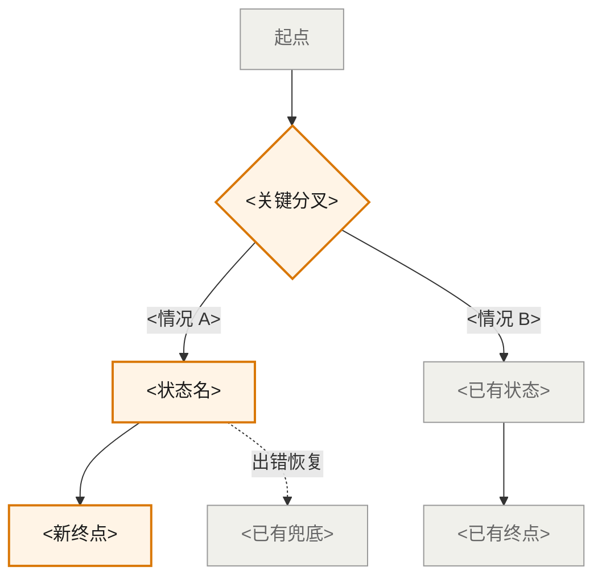
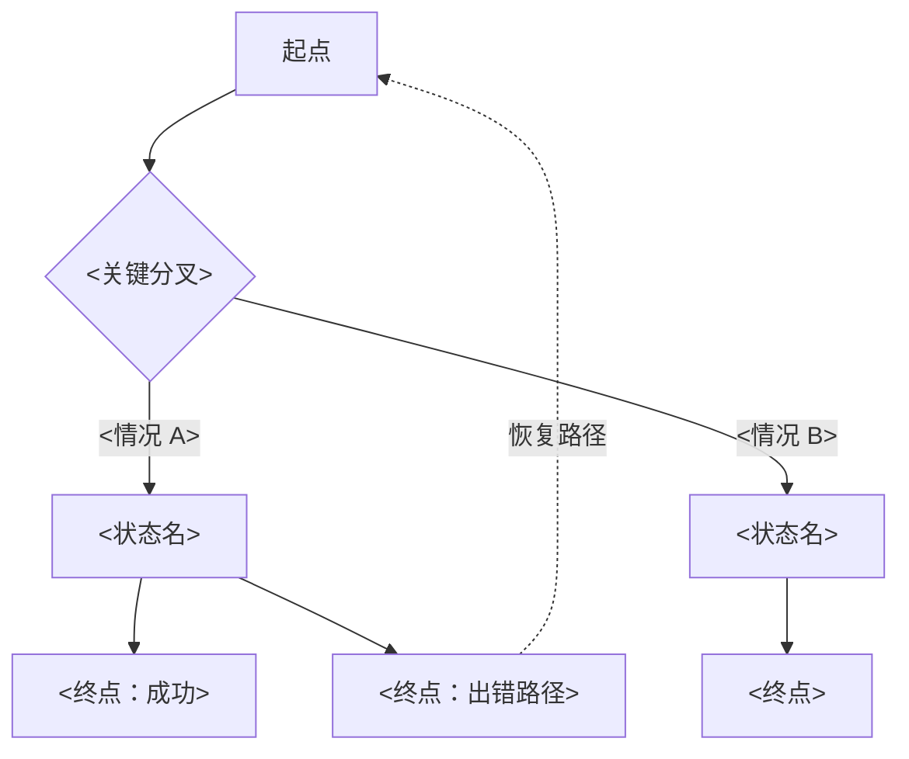

<!--
 Living Onepage 内部说明（agent 用，designer 不需要读）。

Phase-group layout:
- 本文件由 /ux-project:start 生成空 stub，每个 phase 增量填充各自的区块；agent 永不自动改 prior phase 内容（rule 25）。
- Phase 1 填：PRD 一句话总结、Final Goal、Problem Framing、PM ask vs Interpreted、Target Users、User Behaviors、用户场景、Scenario Map（§14）
- Phase 2 填：JTBD（§6）、Constraints、Decisions、Assumptions、Open Questions、Design Direction、Not Doing（§15）
- Phase 3 填：Handoff Notes、IA、Interaction Flow

Cite 信息:
- 本文件 body 绝**不**出现 `[ref: ...]` / `[^d<n>]` / `[^a<n>]` 这类 designer 可见的 ref 标记。Onepage 是给设计师/评审看的产物，干净 prose 即可。
- Agent 在 reasoning 时**内部**知道每条 claim 的来源（PRD / KB / memory）—— 通过 conversation context 维持，不持久化到本文件。
- Phase 3 confirm gate 时跑 cite-check：agent 重新对照每条 substantive claim 与 PRD / KB / memory，作为一张 claim ↔ source 表呈给设计师逐条 approve；approve 通过的 source 写到 decisions.md / assumptions.md（已有文件，带内部 D / A id）—— 不进 onepage。
- 没找到 source 的 claim → 设计师选：补 source / 改为 assumption / 删除。

Stale 处理:
- 全文级 stale / stale_reason 字段已**移除**。
- 改为 state.md frontmatter 的 stale_phase_1 / stale_phase_2 / stale_phase_3 三个 boolean。
- /ux-project:add-context 命中影响 phase 时 set 对应 stale_phase_N=true，由设计师在下次 /ux-project:refine 决定是否 re-walk。

HTML companion:
- /ux-project:export-html 渲染本文件为 ux-onepage.html，要求 phase_3_confirmed_at != null。
- HTML 同样不展示任何 ref 信息。
-->

# UX Onepage: <project-name>

## Phase 1: 用户与问题

### PRD 一句话总结

<AI 读完 PRD 后给一段 50-100 字的提要，让设计师秒判断是否抓到主旨。要涵盖：现状/问题 + 改动核心 + 关键产品价值。>

### 1. Final Goal

<one sentence: who, in what context, achieves what>

### 2. Problem Framing

<2–3 sentences: what we're really solving, distinct from PM's stated solution>

### 3. PM Original Ask vs. Interpreted User Need

| PM Original Ask | Interpreted User Need |
|---|---|
| ... | ... |

### 4. Target Users

#### Primary
<role + key motivation>

#### Secondary
<role + key motivation>

#### Impacted (non-direct)
<role + how impacted>

### 5. User Behaviors

#### Current（线上现状）
<how users do this today>

#### Desired
<how it should work>

#### Failure
<what happens when system fails>

#### Edge
<boundary cases>

### 用户场景

> Phase 1 起步先列 1 个最典型的用户场景，让我们对齐"这个功能可能在解决什么"。这是探索性描述，不是 JTBD —— JTBD 要经过 Phase 1/2 讨论分析后才能产出（见 Phase 2 中的 JTBD 区）。

#### <scenario title>

**用户**：<who — role + brief context>

**场景**：<what situation — 1-2 sentences describing when/where this happens>

**新流程怎么用**：<paragraph: how the feature would be used in this scenario, concrete and vivid>

**产品价值**：<why this matters / what the user gets — 1-2 sentences>

### 14. 用户场景全集与取舍

<这一节列出所有想到的用户场景（6–12 条），并标出每条是否要做。绿色"要做"的场景会变成 Phase 2 的 JTBD；灰色"不做"的写进 §15。**「类型」列只在 `change_type == iteration / refactor` 时填**，标 ★新增 / 改造 / 复用；`new_feature` 项目此列留空或填 ★新增。>

| # | 用户场景 | 来源视角 | 对用户价值 | 实现成本 | 是否核心 | 是否要做 | 类型 |
|---|---|---|---|---|---|---|---|
| S1 | <一句话描述> | 不同用户视角 / 在什么时机 / 边界情况 / 出错后怎么办 / 跨场景 | 高/中/低 | 高/中/低 | 核心/边缘/不在范围 | 要做 / 不做 | ★新增 / 改造 / 复用 |
| S2 | ... | ... | ... | ... | ... | ... | ... |

**类型释义**（iteration / refactor 项目专用）:
- **★新增**: 之前不存在的场景，整个流程都是新加的
- **改造**: 之前有类似场景，本次修改了流程 / 增加分支 / 改变行为
- **复用**: 之前已支持，本次不动；列出来是为了让评审看到全局上下文

## Phase 2: 取舍与约束

### 6. JTBD

> Phase 1+2 讨论后从 KEEP 场景沉淀出来的 user jobs。Primary 是核心驱动需求；Secondary 是细化/辅助；Anti-JTBD 是用户明确不想要的状态。

#### Primary
When <situation>, I want to <action>, so I can <outcome>.

#### Secondary
When ..., I want ..., so...

#### Anti-JTBD
The user does NOT want to <unwanted state>.

### 8. Constraints from KB and project memory

| Constraint | Confidence |
|---|---|
| <KB-derived> | high/medium/low |
| <project memory> | high/medium/low |

### 9. Key Decisions

<lifted from decisions.md, top 3-5>
- D1: ...
- D2: ...

### 10. Active Assumptions

<lifted from assumptions.md, status=active only>
- A1: ... (confidence: medium)

### 11. Open Questions

#### Blocking
- Q1: ... (owner: ...)

#### Deferred
- Q3: ... (owner: ...)

### 12. Design Direction Hypothesis

<this is direction, not UI>

- This is a <configuration / guidance / feedback / monitoring / repair> type of experience.
- Must prioritize <scenario X> in any design exploration.
- Must NOT yet specify <thing>; it depends on <unresolved question>.

### 15. 明确不做的事（和为什么不做）

<§14 里所有"不做"的场景，每条带一个一句话的具体理由。这一节看似简单，其实是整份单页最重要的部分之一——它防止后面来回讨论或被反复加塞。>

- **S<n>：<场景名>** —— <为什么不做>
- **S<n>：<场景名>** —— <为什么不做>
- **S<n>：<场景名>** —— <为什么不做>

## Phase 3: 结构与流程

### 13. Handoff Notes

<what the downstream design skill should know>

- States to consider: default / empty / loading / success / error / permission-restricted / edge
- Key risks downstream should design around: ...
- Reference patterns from KB: ...
- Project-specific stakeholders / terminology / history pointers
- IA / flow are upstream (this onepage); hi-fi UI / Figma is downstream's job.

### 16. 信息架构

<整个产品的内容怎么组织在一起。每个区块只说"做什么用"，不说"长什么样"——颜色、控件、视觉风格留给下一步的 UI 设计。用缩进表示层级。**iteration / refactor 项目**：每个区块前加 `★NEW` / `(改造)` / `(已有)` 前缀标记，让评审一眼看清增量。`new_feature` 项目：不需要前缀。>

**iteration / refactor 项目的标记图例**（new_feature 项目可删此 legend）:
- `★NEW` 全新区块，之前不存在
- `(改造)` 已有区块，本次行为有变化（包括新增子项 / 改交互 / 改流转）
- `(已有)` 已有区块，本次完全不动；列出来是为了让评审看到完整结构

示例（iteration 模式）:

```
<入口>
├── (已有) <一级区域 1>
│   ├── (已有) <子区块 A> — <做什么用：例如"当前任务列表">
│   ├── (改造) <子区块 B> — <做什么用：增加 SMS 状态显示>
│   └── ★NEW <子区块 C> — <做什么用：例如"次要操作入口">
├── ★NEW <一级区域 2>
│   ├── ★NEW <子区块 D> — <做什么用>
│   └── ★NEW <子区块 E> — <做什么用>
└── (已有) <一级区域 3>
    └── (已有) <子区块 F> — <做什么用>
```

示例（new_feature 模式，无前缀）:

```
<入口>
├── <一级区域 1>
│   ├── <子区块 A> — <做什么用>
│   └── <子区块 B> — <做什么用>
└── <一级区域 2>
    └── <子区块 C> — <做什么用>
```

每条用户需求对应到哪里（每条"要做"的需求都必须能找到对应区块；**iteration 项目额外标注是落在哪类区块**）：
- 需求 1 → ★NEW <一级区域 2 / 子区块 D>（全新流程）
- 需求 2 → (改造) <一级区域 1 / 子区块 B> + ★NEW <子区块 C>（改造已有 + 新加入口）
- 需求 3 → (已有) <一级区域 3 / 子区块 F>（用户行为变了，UI 不变）

### 17. 交互流程

<用户从一开始到完成会经过哪些步骤、哪里会分叉、出错时怎么回到正轨。这里只画路径，不画界面——视觉细节在下一步做。选择最合适的图类型：流程图、状态图或时序图。Mermaid 语法。

**iteration / refactor 项目**：所有节点用 `classDef` 着色区分**新增 / 改造 / 已有**。已有节点的存在不是冗余——它告诉评审"用户走的旧路径还在哪儿"，让增量改动有锚点。

**new_feature 项目**：不用 classDef，所有节点同色。>

iteration / refactor 模式（必须包含 classDef + :::class 标注）:



new_feature 模式（不需要 classDef）:



每条用户需求走哪条路：
- 需求 1 → 起点 → 分叉 → 状态 A → 成功终点
- 需求 2 → 起点 → 分叉 → 状态 B → 已有终点
- 需求 3 → 分叉 → 状态 C → 已有终点
