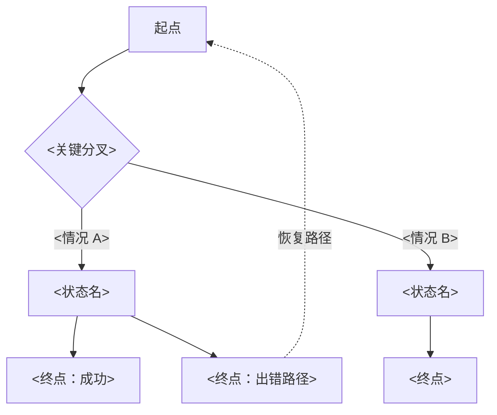

<!--
Cite-or-die rule: every claim below MUST end with [ref: <path>].
- pm-source.md:L<line> for PRD facts
- decisions.md:D<id> for decisions
- assumptions.md:A<id> for assumptions (mark these as inference, not fact)
- questions.md:Q<id> for open questions
- memory/<type>.md#m-<id> for context-memory citations (★ v0.2 — must have status: active)
- <kb-path> for KB-sourced facts (use the actual ctx_search result path)

Outdated PRD refs get ⚠️ outdated marker.
★ v0.2 — Memory cites with status != active block generation (cite-check rejects them).

★ v0.2 — Stale handling:
When stale: true, the skill renders a banner at the top of the body:
> ⚠️ This onepage is stale. Reason: <stale_reason>. Run `/ux-project:onepage` to regenerate.

On regen: produce a diff vs the previous version, show to designer, then on approval:
- overwrite the file
- clear stale=false, stale_reason=null
- bump regen_count
- set last_regen to today

★ v0.4 — Sections layout:
- Sections 1–13: classic discovery output (problem framing, JTBD, scenarios, constraints, decisions, etc.)
- Section 14 (Scenario Map): full Phase 1 expansion result, with KEEP/CUT marker per scenario
- Section 15 (Not Doing): explicit CUT list with reasons (from Phase 2 rubric)
- Section 16 (Information Architecture): IA structure as nested list (no UI controls)
- Section 17 (Interaction Flow): Mermaid flowchart / stateDiagram / sequenceDiagram

★ v0.4 — HTML companion:
- ux-onepage.html is generated alongside ux-onepage.md by /ux-project:onepage
- Renders sections 14–17 as the primary 一图流 visual (scenario map + JTBD cards + IA tree + flow diagram)
- Sections 1–13 appear as supporting context / footnotes
- Cite refs become hover-tooltips or end-of-page footnotes in HTML
- Source of truth is still this .md file with cite-or-die discipline

Sections may be empty if not applicable. Mark empty sections with `_(not applicable)_`
so it's clear they weren't skipped accidentally.
-->

# UX Onepage: <project-name>

<!-- ★ v0.2 — Stale banner inserted here when stale: true. Removed on regen. -->

## 1. Final Goal

<one sentence: who, in what context, achieves what> [ref: ...]

## 2. Problem Framing

<2–3 sentences: what we're really solving, distinct from PM's stated solution> [ref: ...]

## 3. PM Original Ask vs. Interpreted User Need

| PM Original Ask | Interpreted User Need | Source |
|---|---|---|
| ... | ... | [ref: pm-source.md:L...] |

## 4. Target Users

### Primary
<role + key motivation> [ref: ...]

### Secondary
<role + key motivation> [ref: ...]

### Impacted (non-direct)
<role + how impacted> [ref: ...]

## 5. User Behaviors

### Current (Online Baseline) ★ v0.4
<how users do this today; reference baseline memory> [ref: memory/baseline.md#m-bsl-001]

### Desired
<how it should work> [ref: ...]

### Failure
<what happens when system fails> [ref: ...]

### Edge
<boundary cases> [ref: ...]

## 6. JTBD

### Primary
When <situation>, I want to <action>, so I can <outcome>. [ref: ...]

### Secondary
When ..., I want ..., so ... [ref: ...]

### Anti-JTBD
The user does NOT want to <unwanted state>. [ref: ...]

## 7. Key Scenarios

1. **<scenario name>** — <one-line description> [ref: ...]
2. **<scenario name>** — ... [ref: ...]
3. **<scenario name>** — ... [ref: ...]

## 8. Constraints from KB and project memory

| Constraint | Source | Confidence |
|---|---|---|
| <KB-derived> | [ref: <kb-path>] | high/medium/low |
| <project memory> | [ref: memory/constraints.md#m-cst-001] | high/medium/low |

## 9. Key Decisions

<lifted from decisions.md, top 3-5>
- D1: ... [ref: decisions.md:D1]
- D2: ... [ref: decisions.md:D2]

## 10. Active Assumptions

<lifted from assumptions.md, status=active only>
- A1: ... (confidence: medium) [ref: assumptions.md:A1]

## 11. Open Questions

### Blocking
- Q1: ... (owner: ...) [ref: questions.md:Q1]

### Deferred
- Q3: ... (owner: ...) [ref: questions.md:Q3]

## 12. Design Direction Hypothesis

<this is direction, not UI>

- This is a <configuration / guidance / feedback / monitoring / repair> type of experience. (inference)
- Must prioritize <scenario X> in any design exploration. [ref: ...]
- Must NOT yet specify <thing>; it depends on <unresolved question>. [ref: questions.md:Q...]

## 13. Handoff Notes

<what the downstream design skill should know>

- States to consider: default / empty / loading / success / error / permission-restricted / edge
- Key risks downstream should design around: ...
- Reference patterns from KB: ... [ref: ...]
- ★ v0.2 — Project-specific stakeholders / terminology / history pointers: [ref: memory/...]
- ★ v0.4 — IA / flow are upstream (this onepage); hi-fi UI / Figma is downstream's job.

## 14. 用户场景全集与取舍 ★ v0.4

<这一节列出所有想到的用户场景（6–12 条），并标出每条是否要做。绿色"要做"的场景会变成第 6 节的"用户真正想完成的事"；灰色"不做"的写进第 15 节。>

| # | 用户场景 | 来源视角 | 对用户价值 | 实现成本 | 是否核心 | 是否要做 | 引用 |
|---|---|---|---|---|---|---|---|
| S1 | <一句话描述> | 不同用户视角 / 在什么时机 / 边界情况 / 出错后怎么办 / 跨场景 | 高/中/低 | 高/中/低 | 核心/边缘/不在范围 | 要做 / 不做 | [ref: ...] |
| S2 | ... | ... | ... | ... | ... | ... | [ref: ...] |
| ... | | | | | | | |

## 15. 明确不做的事（和为什么不做） ★ v0.4

<上一节里所有"不做"的场景，每条带一个一句话的具体理由。这一节看似简单，其实是整份单页最重要的部分之一——它防止后面来回讨论或被反复加塞。>

- **S<n>：<场景名>** —— <为什么不做> [ref: ...]
- **S<n>：<场景名>** —— <为什么不做> [ref: ...]
- **S<n>：<场景名>** —— <为什么不做> [ref: ...]

## 16. 信息架构 ★ v0.4

<整个产品的内容怎么组织在一起。每个区块只说"做什么用"，不说"长什么样"——颜色、控件、视觉风格留给下一步的 UI 设计。用缩进表示层级。>

```
<入口>
├── <一级区域 1>
│   ├── <子区块 A> — <做什么用：例如"当前任务列表">
│   ├── <子区块 B> — <做什么用：例如"状态概览">
│   └── <子区块 C> — <做什么用：例如"次要操作入口">
├── <一级区域 2>
│   ├── <子区块 D> — <做什么用>
│   └── <子区块 E> — <做什么用>
└── <一级区域 3>
    └── <子区块 F> — <做什么用>
```

每条用户需求对应到哪里（每条"要做"的需求都必须能找到对应区块）：
- 需求 1 → <一级区域 1 / 子区块 A>
- 需求 2 → <一级区域 2 / 子区块 D + E>
- ...

## 17. 交互流程 ★ v0.4

<用户从一开始到完成会经过哪些步骤、哪里会分叉、出错时怎么回到正轨。这里只画路径，不画界面——视觉细节在下一步做。选择最合适的图类型：流程图、状态图或时序图。Mermaid 语法。>



或（状态驱动型用这个）：

```mermaid
stateDiagram-v2
    [*] --> <状态 1>
    <状态 1> --> <状态 2>: <触发条件>
    <状态 2> --> <状态 3>
    <状态 3> --> [*]
```



每条用户需求走哪条路（每条"要做"的需求都必须能走通至少一条路径）：
- 需求 1 → 起点 → 分叉(A) → 状态 A → 成功终点
- 需求 2 → 起点 → 分叉(B) → 状态 B → 成功终点
- ...
